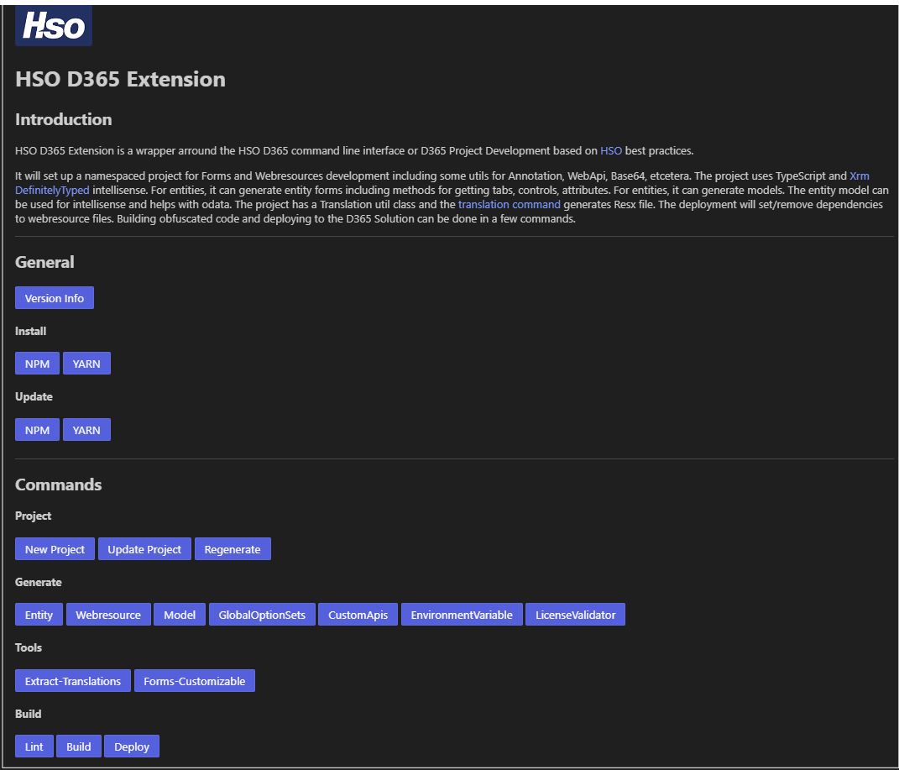

# VScode Extension for HSO D365-CLI

This is a VS Code extension for the HSO D365-CLI

## D365-CLI

A [Command-line interface](https://en.wikipedia.org/wiki/Command-line_interface) for D365 Project
Development based on [HSO](https://www.hso.com) best practices. 

Click [here](https://github.com/hso-nn/d365-cli) for more info.

## Release Notes

### 1.0.1

Initial release of hso-d365 cli

### 1.1.0

Added webview menu structure reflecting the hso-d365 cli. Call it in command bar by "hso-d365: Main" of use keybing "ctrl-alt-h"

